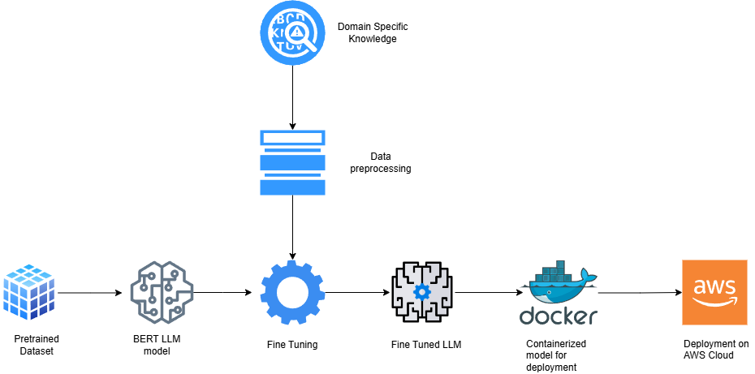

# Fine-Tuning a Transformer Model for Sentiment Classification
## Transfer Learning for Sentiment Analysis using Transformers with Distil Bert Multilingual Cased

## To execute Dockerfile
```bash
docker build -t sentiment-analysis .
```

```bash
docker run --rm sentiment-analysis --sentence "This is an amazing project!"
```


# Introduction
In recent years, sentiment analysis has become an essential tool for understanding the opinions and emotions expressed in large volumes of textual data. With the exponential growth of digital interactions—whether on social media, forums, or product reviews—the need to interpret these emotions in an automated way has become increasingly relevant.

This project aims to develop a sentiment classification model using advanced artificial intelligence algorithms, focusing on neural networks and transformer architecture. By applying these technologies, we seek to identify and categorize sentiments (joy, sadness, anger, fear, love and surprise) present in texts collected from a dataset available on Kaggle.


## Dataset
**Dataset Card for TSATC: Twitter Sentiment Analysis Training Corpus**

Dataset Summary
TSATC: Twitter Sentiment Analysis Training Corpus The original Twitter Sentiment Analysis Dataset contains 1,578,627 classified tweets, each row is marked as 1 for positive sentiment and 0 for negative sentiment. It can be downloaded from [Oficial link](http://thinknook.com/wp-content/uploads/2012/09/Sentiment-Analysis-Dataset.zip). The dataset is based on data from the following two sources:

University of Michigan Sentiment Analysis competition on Kaggle Twitter Sentiment Corpus by Niek Sanders

This dataset has been transformed, selecting in a random way a subset of them, applying a cleaning process, and dividing them between the test and train subsets, keeping a balance between the number of positive and negative tweets within each of these subsets. These two files can be founded on [github.com](https://github.com/cblancac/SentimentAnalysisBert/blob/main/data).

Finally, the train subset has been divided in two smallest datasets, train (80%) and validation (20%). The final dataset has been created with these two new subdatasets plus the previous test dataset.

## Project structure

### Flowchart of this project:



1. **Pretrained Dataset**: Raw data used for pretraining the base model (BERT).  
2. **BERT LLM Model**: Pretrained language model serving as the foundation for specialization. <br/><br/>
3. **Domain-Specific Knowledge**: Specialized domain knowledge incorporated to enhance the model's fine-tuning process.  
4. **Data Preprocessing**: Cleaning and preparing domain-specific data to adapt it for use during fine-tuning.  <br/><br/>
5. **Fine Tuning**: The process of adjusting the model with domain-specific data to meet the desired task (e.g., sentiment classification).  
6. **Fine Tuned LLM**: A fine-tuned language model, ready for inference in the target application.  
7. **Containerized Model for Deployment**: The model encapsulated in a container (e.g., Docker) to facilitate deployment.  
8. **Deployment on AWS Cloud**: Implementation of the model in a scalable cloud environment using AWS services.  


### Directory structure:

mlops-sentiment-analysis/ <br/>
├── config/  <br/>
│    └── config.json  <br/>
├── data/  <br/>
│    ├── dataset.py  <br/>
│    ├── test_data.txt  <br/>
│    └── train_data.txt  <br/>
├── dist/  <br/>
│    └── transfer learning using bert-0.1.0.tar.gz  <br/>
├── models/  <br/>
│    ├── classifier.py  <br/>
│    └── model_v1_complete.pth  <br/>
├── notebooks/  <br/>
│    └── transformer.ipynb  <br/>
├── utils/  <br/>
│    ├── preprocessing.py  <br/>
│    └── trainer.py  <br/>
├── assets/  <br/>
│    └── sentiment_analysis.png  <br/>
├── Dockerfile  <br/>
├── inference.py  <br/>
├── label_encoder_weights.joblib  <br/>
├── poetry.lock  <br/>
├── pyproject.toml  <br/>
├── README.md  <br/>
├── special_tokens_map.json  <br/>
├── tokenizer_config.json  <br/>
├── train.py  <br/>
└── vocab.txt  <br/>

1. **Root Directory**: `03-sentiment-analysis/`  
   - The main directory containing all project files and subdirectories.

2. **Configuration**: `config/`  
   - `config.json`: JSON file containing project settings and hyperparameters.

3. **Data**: `data/`  
   - `dataset.py`: Script for loading and managing the dataset.  
   - `test_data.txt`: Text file containing test data samples.  
   - `train_data.txt`: Text file containing training data samples.

4. **Distributable Package**: `dist/`  
   - `transfer learning using bert-0.1.0.tar.gz`: Packaged and versioned project distribution for deployment.

5. **Models**: `models/`  
   - `classifier.py`: Python script for defining the classification model.  
   - `model_v1_complete.pth`: Trained model checkpoint file (PyTorch format).

6. **Notebooks**: `notebooks/`  
   - `transformer.ipynb`: Jupyter notebook containing transformer-based model experiments.

7. **Utilities**: `utils/`  
   - `preprocessing.py`: Script for data preprocessing steps.  
   - `trainer.py`: Script for managing model training processes.

8. **Assets**: `assets/`  
   - `sentiment_analysis.png`: Visualization of the sentiment analysis pipeline.

9. **Containerization**:  
   - `Dockerfile`: Instructions for containerizing the application.

10. **Inference**:  
    - `inference.py`: Script for running model inference on new inputs.

11. **Label Encoder Weights**:  
    - `label_encoder_weights.joblib`: Serialized file for mapping labels to numerical representations.

12. **Dependency Management**:  
    - `poetry.lock`: Lockfile for dependency management (generated by Poetry).  
    - `pyproject.toml`: Project metadata and dependency configuration (managed by Poetry).

13. **Documentation**:  
    - `README.md`: Main documentation file providing an overview of the project.

14. **Tokenizer Files**:  
    - `special_tokens_map.json`: Mapping file for special tokens used by the tokenizer.  
    - `tokenizer_config.json`: Configuration file for the tokenizer.  
    - `vocab.txt`: Vocabulary file used by the tokenizer.

15. **Training**:  
    - `train.py`: Script for training the model.  

---
## Neural Networks Archtecture

### Transformers
Transformers are a type of neural network architecture that use self-attention mechanisms to process input data in parallel, enabling them to capture long-range dependencies more efficiently than traditional recurrent models like LSTMs. Unlike RNNs, transformers handle the entire input sequence at once, making them ideal for tasks that require understanding context over large sequences, such as natural language processing (NLP), machine translation, and text generation. The key components of a transformer model are:
- **Self-Attention Mechanism**: Allows the model to weigh the importance of different words or tokens in a sequence.
- **Positional Encoding**: Injects information about the position of tokens since transformers don't inherently process sequentially.
- **Multi-Head Attention**: Uses multiple self-attention mechanisms in parallel to capture different aspects of the input.
- **Feedforward Layers**: Dense layers applied after the attention mechanism to generate outputs.
This architecture has become a foundation for modern NLP models like BERT and GPT.


**DistilBERT Base Multilingual Cased**:<br/>
DistilBERT is a smaller, faster, and more efficient version of BERT (Bidirectional Encoder Representations from Transformers) that retains 97% of its performance while being 60% smaller and 2x faster. The **Base Multilingual Cased** variant is trained on a wide variety of languages (104 in total) and is case-sensitive, meaning it distinguishes between upper- and lower-case letters.

DistilBERT uses a process called **knowledge distillation**, where a smaller "student" model (DistilBERT) is trained to mimic a larger "teacher" model (BERT). This allows it to capture the knowledge of the larger model while being more efficient in terms of memory and computation. The **multilingual** nature allows it to perform well across different languages, and the **cased** aspect makes it sensitive to differences in capitalization, which is important for tasks that require fine-grained text understanding.

This architecture is commonly used for various NLP tasks, including text classification, named entity recognition, and language translation across multiple languages.


**Using DistilBERT Base Multilingual Cased for Transfer Learning**

DistilBERT base multilingual cased is a lighter, faster version of BERT that supports multiple languages and is well-suited for transfer learning on NLP tasks such as text classification, sentiment analysis, or question answering across diverse languages. The following steps outline how to fine-tune DistilBERT on a new dataset to adapt it to a specific task.

**Step 1: Load the Model and Tokenizer**

The Hugging Face Transformers library provides an easy way to load pre-trained models. We’ll start by loading the `distilbert-base-multilingual-cased` model along with its tokenizer, specifying the number of labels required for our task (e.g., 2 labels for binary classification).

**Step 2: Preprocess Input Data**

Before passing text to the model, it needs to be tokenized. Tokenization converts text into numerical format, along with padding and truncation to ensure uniform input lengths, which is crucial for efficient batching.

**Step 3: Fine-Tune the Model**

To adapt DistilBERT to our specific task, we'll fine-tune it on labeled data. This can be done efficiently using Hugging Face’s `Trainer` API, which manages the training loop and optimizes model weights to minimize loss on the training data.

**Step 4: Evaluate and Deploy**

After fine-tuning, we'll evaluate the model on a validation dataset to measure performance. Then, we'll save the fine-tuned model for future use and deploy it to handle inference requests.


---
## Other Implementations

You can see other implementations and also a benchmark comparing other architectures. such as Basic DNN and LSTM here: [Sentiment Analysis](https://github.com/Krupique/transformers/tree/main/03-sentiment-analysis)
